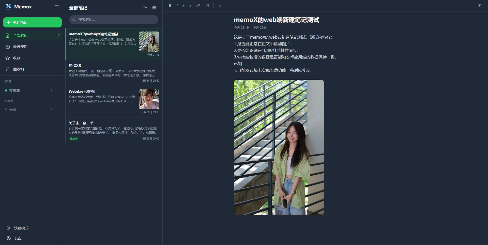

# memoX Web

[memoX](https://github.com/W4J1e/memox) 的网页版本，与 Android 端数据完全兼容。



## 功能特性

- **笔记与清单** — 创建文本笔记和待办清单，支持富文本编辑
- **图片插入** — 在笔记中插入图片
- **标签分类** — 使用标签管理和筛选笔记，支持隐藏标签
- **WebDAV 同步** — 通过 WebDAV 服务器双向同步笔记和附件
  - 打开页面时自动拉取远端更新
  - 编辑笔记后自动同步到远端
  - 支持手动上传/下载
- **深色模式** — 支持浅色、深色、跟随系统三种主题
- **PIN 锁定** — 设置 PIN 码保护应用和加密笔记，可选启动时锁定
- **数据导出** — 支持导出为 JSON 格式

## 技术栈

- Vue 3 + Vite
- Pinia 状态管理
- IndexedDB 本地存储
- Tailwind CSS
- WebDAV 协议同步

## 开发

```bash
# 安装依赖
npm install

# 启动开发服务器（含内置 WebDAV 代理）
npm run dev

# 构建生产版本
npm run build
```

## 部署

### Vercel（推荐）

1. Fork 或导入此仓库到 GitHub
2. 在 [Vercel](https://vercel.com) 中导入该项目
3. 无需额外配置，直接部署
4. 部署完成后访问 Vercel 分配的域名即可使用

项目内置了 Vercel Serverless Function 作为 WebDAV 代理，`vercel.json` 已配置路由重写，`/__dav__/*` 请求会自动转发到 `api/__dav__/[...path].js`，由它代理 WebDAV 请求并添加 CORS 头。

> **注意**：Vercel Hobby 计划函数超时 10s、请求体限制 4.5MB，Pro 计划为 60s / 50MB。

### 自托管服务器

构建产物在 `dist/` 目录下，可部署到任意静态文件服务器。

若 WebDAV 服务器不支持 CORS，需要部署反向代理：

- 使用项目中的 `server.js` 代理服务器：`node server.js`
- 或通过 nginx 配置反向代理

## 数据兼容

Web 端与 [memoX Android](https://github.com/W4J1e/memox) 应用使用相同的数据格式：

- 笔记以 JSON 文件存储在 WebDAV 的 `memoX/notes/` 目录
- 图片附件存储在 `memoX/attachments/` 目录
- 同步元数据存储在 `memoX/sync_meta.json`
- 双端可无缝切换使用

## 开源许可

[GPL-3.0](https://cnb.cool/hin/memox_web/-/blob/main/LICENSE)
