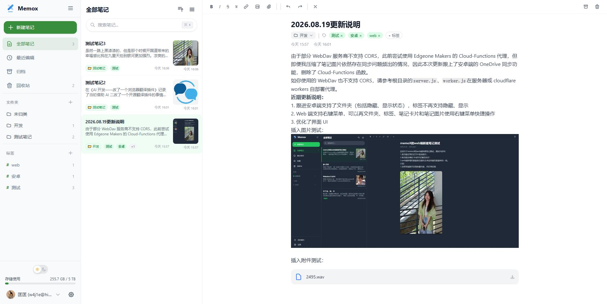
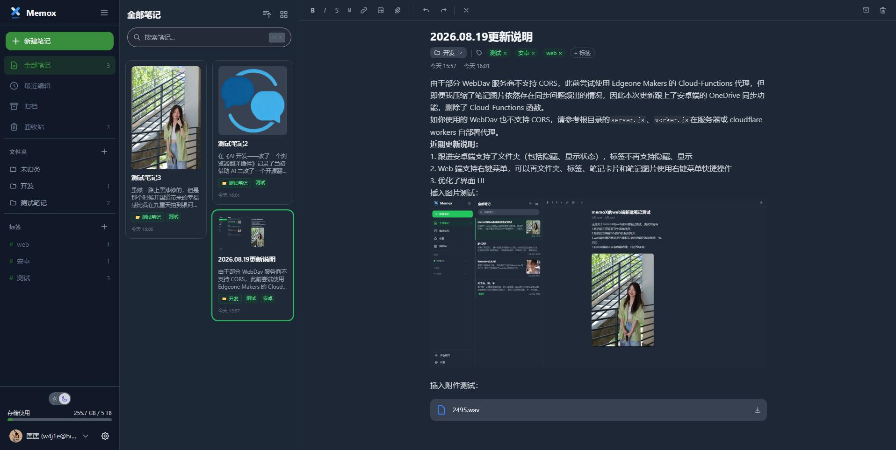

# memoX Web

[memoX](https://github.com/W4J1e/memox) 的网页版本，与 Android 端数据完全兼容。





## 0819更新说明

由于部分 WebDav 服务商不支持 CORS，此前尝试使用 Edgeone Makers 的 Cloud-Functions 代理，但即便我压缩了笔记图片依然存在同步问题频出的情况，因此本次更新跟上了安卓端的 OneDrive 同步功能，删除了 Cloud-Functions 函数。

如你使用的 WebDav 也不支持 CORS，请参考根目录的`server.js`、`worker.js`在服务器或 cloudflare workers 自部署代理。

## 功能特性

- **笔记与清单** — 创建文本笔记和待办清单，支持富文本编辑
- **图片插入** — 在笔记中插入图片
- **标签分类** — 使用标签管理和筛选笔记，支持隐藏标签
- **WebDAV 同步** — 通过 WebDAV 服务器双向同步笔记和附件（支持直连/代理两种连接模式）
- **OneDrive 同步** — 通过 Microsoft Graph 直连 OneDrive，与 WebDav 共用同一目录结构
- **深色模式** — 支持浅色、深色、跟随系统三种主题
- **PIN 锁定** — 设置 PIN 码保护应用和加密笔记，可选启动时锁定
- **数据导出** — 支持导出为 JSON 格式
- **灵动岛** — 实时展示同步状态

## 技术栈

- Vue 3 + Vite
- Pinia 状态管理
- IndexedDB 本地存储
- Tailwind CSS
- WebDAV 协议同步

## 开发

```bash
# 安装依赖
npm install

# 启动开发服务器
npm run dev

# 构建生产版本
npm run build
```

## 部署

### EdgeOne Makers（推荐）

1. Fork 或导入此仓库
2. 在 EdgeOne Makers 中导入该项目（会自动识别为 Vite 项目）
3. 配置环境变量

> 从2026年8月19日后，站点本身是纯静态应用，不再依赖任何服务端函数。WebDAV 同步在浏览器中直连服务器（直连模式）或经你自建的代理中转（代理模式）。

#### 环境变量

| 变量 | 说明 |
| --- | --- |
| `VITE_ONEDRIVE_CLIENT_ID` | **必需**。OneDrive 同步使用的 Azure AD 应用（客户端）ID |

本地开发复制 `.env.example` 为 `.env.local` 使用；生产环境在构建平台的构建设置中配置同名变量（仅 `VITE_` 前缀的变量会注入前端代码）。

### 自托管服务器

构建产物在 `dist/` 目录下，可部署到任意静态文件服务器。

WebDAV 连接模式（在设置页中选择）：

- **直连模式**：浏览器直接访问 WebDAV 服务器，要求该服务器已开启 CORS
- **代理模式**：通过代理服务中转，适用于服务器未开启 CORS 的场景：
  - 使用项目中的 `server.js` 代理服务器：`node server.js`（默认端口 3001，同时托管 `dist/` 静态文件，代理端点为 `/__dav__/`）
  - 在设置中填写代理地址（如 `http://your-host:3001/__dav__/`），客户端会将真实 WebDAV 地址通过 `X-WebDAV-Url` 请求头转发

## 数据兼容

Web 端与 [memoX Android](https://github.com/W4J1e/memox) 应用使用相同的数据格式：

- 笔记以 JSON 文件存储在 WebDAV 的 `memoX/notes/` 目录
- 图片附件存储在 `memoX/attachments/` 目录
- 同步元数据存储在 `memoX/sync_meta.json`
- 双端可无缝切换使用

## 开源许可

[GPL-3.0](https://cnb.cool/hin/memox_web/-/blob/main/LICENSE)
